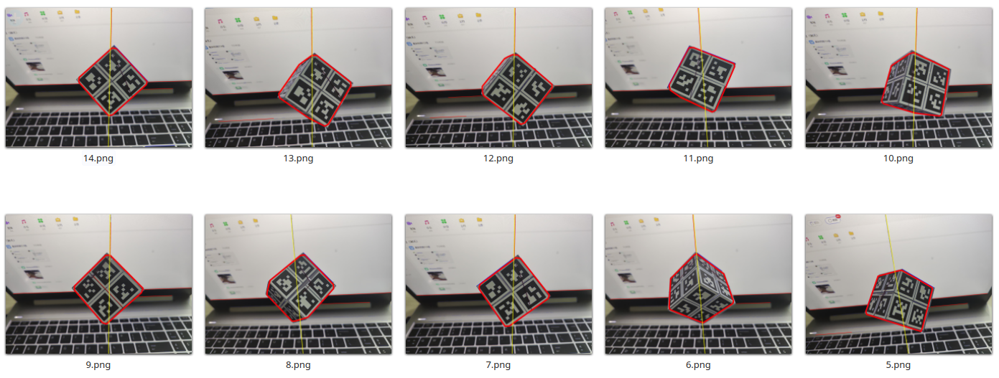

[中文文档](./README_cn.md)
# Inertia Parameter Calibration Tool

This tool uses a simple pendulum experiment to detect the hanging line using OpenCV, detect the Apriltag markers on the object, construct a graph optimization problem, and solve it using gtsam to recover the center of mass position of the object.

## Results

The visualized results after solving the problem are shown below. The red lines represent the initial center of mass position, and the green coordinate system represents the optimized center of mass coordinates.

After inputting the images captured during the pendulum experiment, the program automatically detects the hanging line and Apriltag markers, and solves for the center of mass position.

Error results for each frame during the solving process

## Required Data

1. Camera intrinsic parameters (can be calibrated using the [apriltag_bundle_calibrate](https://github.com/ZXW2600/apriltag_bundle_calibrate) toolkit)
2. Apriltag calibration results (can be calibrated using the [apriltag_bundle_calibrate](https://github.com/ZXW2600/apriltag_bundle_calibrate) toolkit)
3. Pendulum experiment photo data
