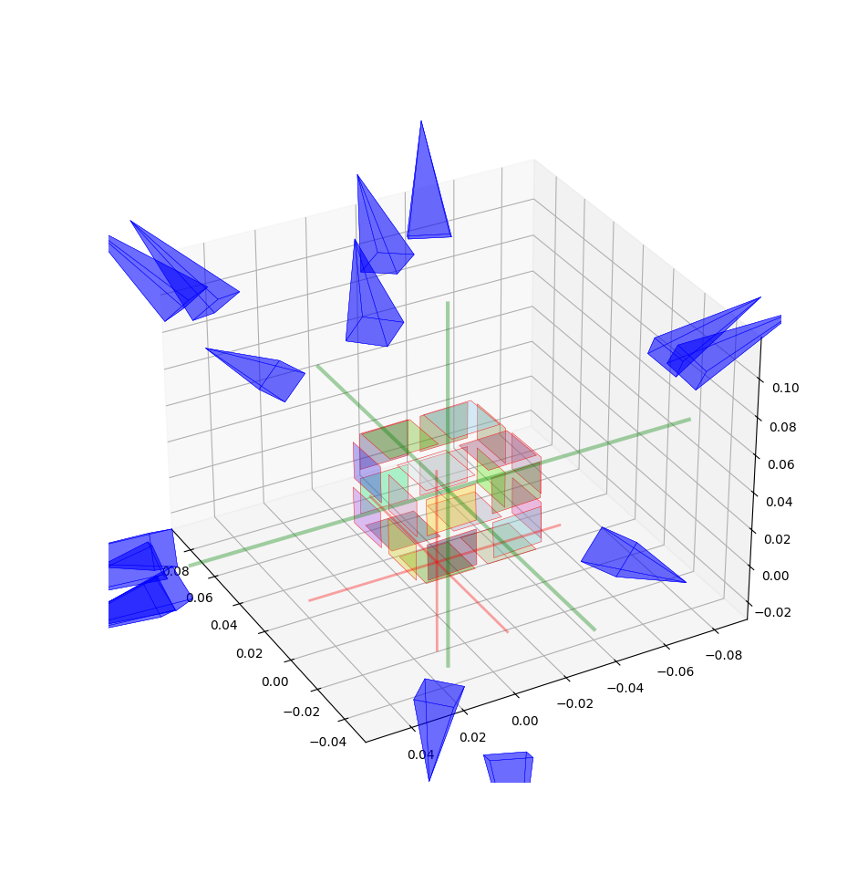
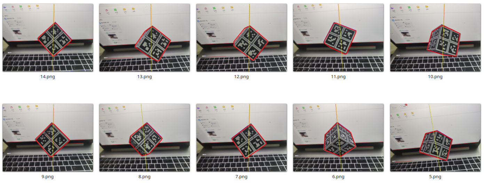
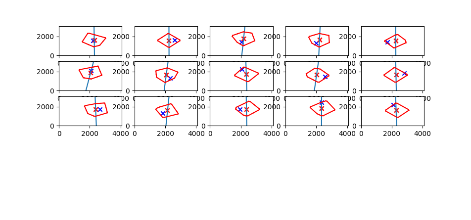

# 惯性参数标定工具

此工具使用简单的悬垂实验，通过Opencv识别悬垂线，检测物体上的Apriltag标识，构建图优化问题并使用gtsam求解，恢复物体的重心位置。

## 结果

求解后的可视化结果如下,红色线条为初始化重心位置，绿色坐标系为优化后的重心坐标系。

输入悬垂实验拍摄的图片后，程序自动检测悬垂线以及Apriltag标识，并求解重心位置。

求解过程中每帧图像的误差结果

## 所需数据

1. 相机的内参 (可以通过[apriltag_bundle_calibrate](https://github.com/ZXW2600/apriltag_bundle_calibrate)工具包标定)
2. Apriltag标定结果 (可以通过[apriltag_bundle_calibrate](https://github.com/ZXW2600/apriltag_bundle_calibrate)工具包标定)
3. 悬垂实验照片数据